# Word-Wise Algorithm Project

This project is a Python implementation of a Wordle solver using the Selenium web automation framework. 
Wordle is a word puzzle game where the player tries to guess a five-letter word within a limited number of attempts.

## Table of Contents

1. [Introduction](#Introduction)
2. [Selenium](#Selenium)
3. [algorithm.py](#algorithm-structure-algorithmpy)
4. [test.py](#Wordle-Game-Simulation-and-Testing-testpy)
5. [compare.py](#Wordle-Data-Analysis-and-Visualization-graphpy)
6. [graph.py](#wordle-data-analysis-and-visualization-graphpy)
7. [Installation](#Installation)


## Introduction
Welcome to the Wordle Solver and Simulator project!
This repository contains a collection of Python scripts and utilities designed to simulate and analyze Wordle games, 
as well as develop and test a Wordle-solving algorithm. Wordle is a popular word puzzle game where players attempt 
to guess a secret 5-letter word within six attempts.

https://github.com/josephjquinn/word-wise/assets/81782398/4ebdb953-601d-47a7-9b9f-b12863a13923

    
## Features
- Efficient wordle algorithm
- Automated Wordle solving using Selenium.
- Word removal and suggestion strategies.
- 1000+ game simulation
- Data collection / Graphs
- Best starting word test script

## Selenium
In this project, we leverage the power of Selenium, a popular web automation tool, to interact with the Wordle website. 
Selenium allows us to programmatically navigate the website, submit guesses, retrieve puzzle data, and gather 
Wordle game statistics for analysis. Here's how Selenium is used in this project:

- ### 1. Web Scraping Results
    Selenium is employed to scrape the Wordle website and extract its html source in order to track the colors of our guesses
    It looks for the color feedback (green, yellow, white) to determine which letters are correct and in the right position, 
    which are correct but in the wrong position, and which are incorrect.This list serves as the basis for Wordle game simulations and solving attempts.
    This is all accomplished by the `parseHTML` function in helper.py. This data is then fed to the algorithm in order to generate
    the next guess.
- ### 2. Submitting Word Guesses
    Selenium also takes charge of interacting with the Wordle website to submit guesses. It inputs each letter of the suggested guess
    into the website via the letter buttons. Once Selenium has entered the entire guessed word, it simulates the action 
    of submitting the guess by pressing the "Submit" button on the website. This triggers the evaluation of the guess, and 
    the process is repeated
### `game.py`
This version interacts with the Wordle game hosted on wordle-vanilla.vercel.app. This alternate version of the website 
allows for unlimited games per day and the script will run for as many games as you choose.

### `nytgame.py`
This version will interact with the official New York Times hosted website and solve the daily wordle. The solution will
stays the same every day but is the same for everyone who uses the site.


## Algorithm Structure `algorithm.py`
The algorithm.py script contains a collection of functions designed to solve the puzzles and assist in generating optimal guesses. 
These functions are crucial for automating the Wordle gameplay and enhancing the efficiency of solving the puzzle.


### Functions Overview

### 1. `get_wordle_guesses()`

This function reads a list of potential words from the `wordlist.txt` file, serving as the pool of words from which the algorithm selects guesses during gameplay.

### 2. `badLetters(result, guess)`

The `badLetters` function identifies and returns letters in the current guess that are marked as "w" (wrong) in the feedback result from Wordle.

### 3. `partialLetters(result, guess)`

`partialLetters` detects letters in the guess that are marked as "y" (yellow) in the result string, indicating that they are correctly guessed but misplaced within the word.

### 4. `correctLetters(result, guess)`

`correctLetters` identifies letters that are both correct and correctly positioned within the word. It returns the correctly placed letters marked as "g" (green) in the result string.

### 5. `word_remover(result, guess, possible_words)`

This function refines the list of possible words based on the feedback from previous guesses. It iteratively eliminates words that contain incorrect letters, ensures the correct placement of guessed letters, and removes words with letters that have already been correctly placed.

### 6. `letterFreq(possible_words)`

`letterFreq` calculates the frequency of each letter in each position across the list of possible words, providing insights into the distribution of letters.

### 7. `wordScore(possible_words, frequencies)`

This function computes a score for each word in the list of possible words based on letter frequencies. It assigns higher scores to words that match the observed letter distribution and introduces a small random factor to encourage exploration.

### 8. `bestWord(possible_words, frequencies)`

`bestWord` selects the optimal word to guess based on the computed scores. It iterates through the list of possible words and chooses the word with the lowest score, indicating the highest likelihood of matching the solution.

### Algorithm Workflow

The algorithm works by progressively narrowing down the list of possible words, prioritizing guesses with the highest probability of success, and ultimately solving Wordle puzzles efficiently. It leverages feedback from previous guesses and statistical analysis of letter frequencies to make intelligent decisions and approach the solution systematically.

By employing these functions strategically, the Wordle solver significantly improves the chances of correctly guessing the target word within the allotted number of attempts.

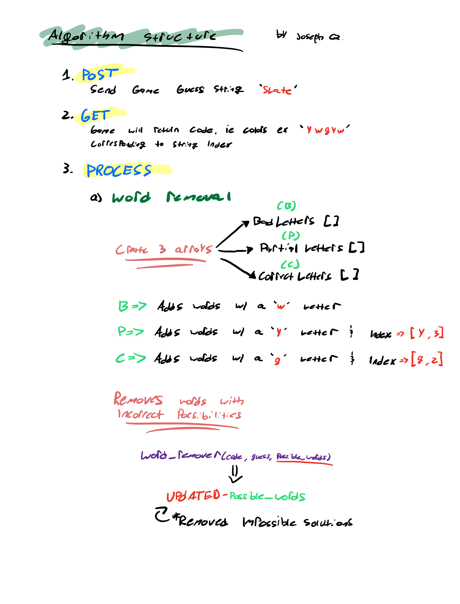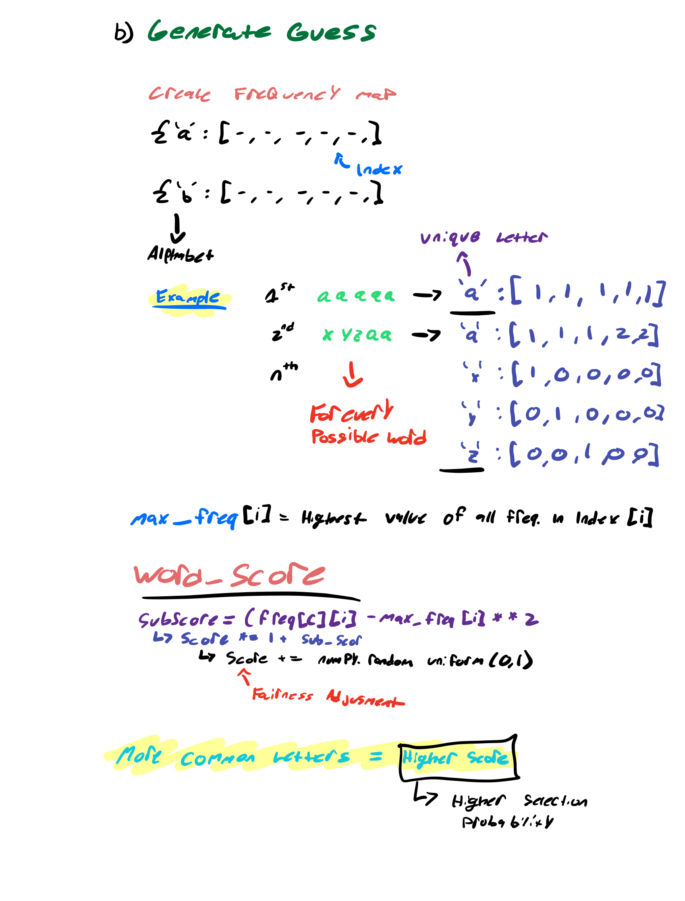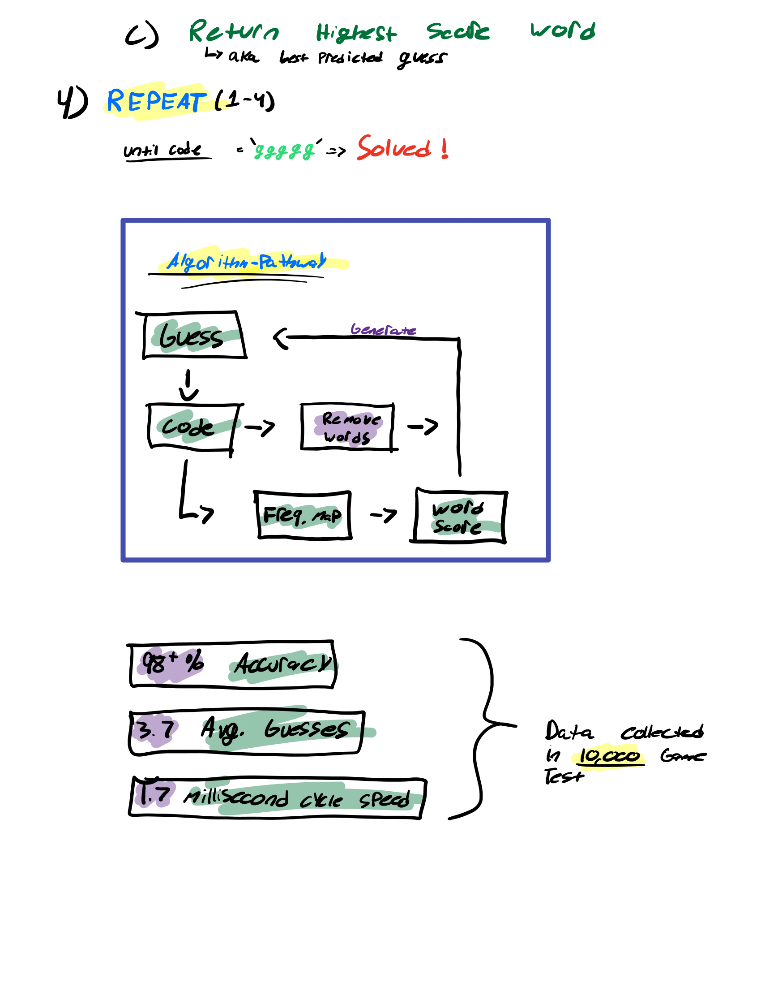

For detailed information on each function and their implementation, refer to the `algorithm.py` script.


## Wordle Game Simulation and Testing `test.py`
This part of the project allows you to evaluate the algorithm's effectiveness in solving Wordle puzzles efficiently, it 
does this by running it through a simulation of a wordle game a certain amount of times and collecting the data.

### Variable Adjustments
run_game(games): Adjust the number of Wordle games to simulate by changing the games parameter. Default is 1000

guess = "slate": Adjust this to change the starting word the simulation will use. Default is "slate"See `compare.py`
to see what the algorithm deems the best starting word

### Example Output
```
---------------------------------
Total Guesses: 3753
Total Time: 1.22616 seconds
Average Guess # until solve : 3.75300
Solve Percentage : 98.6%
---------------------------------
```

### Exported Data
The script exports the following data to the `test_data.csv` file:
-  Game Number
-  Number of Guesses Made
-  Puzzle Solved (True/False)
-  Time Taken to Solve (in seconds)
-  Solution Word
-  First Guess Result


## Finding The Best Starting Word `compare.py`
This part of the project focuses on simulating Wordle games and comparing different starting words' performance. 
The compare.py script allows you to test various starting words and evaluates their effectiveness in solving Wordle puzzles efficiently.

### Usage
Prepare a list of starting words: Create a text file (startwords.txt) containing a list of words you want to test as initial guesses.

Run the script: Execute the script with the prepared list of starting words. For each word in the list, the script simulates a specified number of Wordle games (e.g., 100) with that word as the initial guess.

Results and Comparison: The script collects data on the average number of guesses required to solve the puzzle and the solve percentage for each starting word.
This data will be saved to `starting_words_data.csv` for processing.
### Example Output
````
Testing word: hello
Avg Guesses per game: 3.12
Solve Percentage : 95.00%
Simulation Time: 1.234 seconds
--------------------------------------------------
Testing word: puzzle
Avg Guesses per game: 3.40
Solve Percentage : 97.50%
Simulation Time: 1.345 seconds
--------------------------------------------------
Testing word: slate
Avg Guesses per game: 3.13
Solve Percentage : 98.20%
Simulation Time: 1.045 seconds
--------------------------------------------------
...
Avg Attempts for starting word: 
hello: 3.12
puzzle: 3.40
slate
...

Data list saved to starting_words_data.csv
````


## Wordle Data Analysis and Visualization `graph.py`
This part of the project focuses on analyzing and visualizing Wordle game data. The graph.py script reads game data from a CSV file, 
performs various analyses, and generates informative graphs and visualizations to gain insights into the Wordle gameplay. 

### 1. Data Import 
It reads and imports data from the `test_data.csv` file.
### 2. Graph Generation
- #### Solve Percentage Pie Chart
  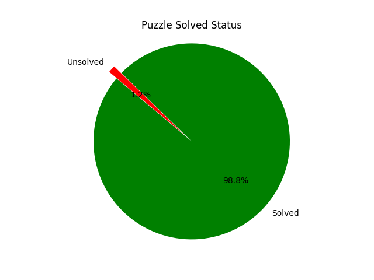
  This pie chart shows the ratio of solved to unsolved games.
- #### Number of Guesses Bar Plot
  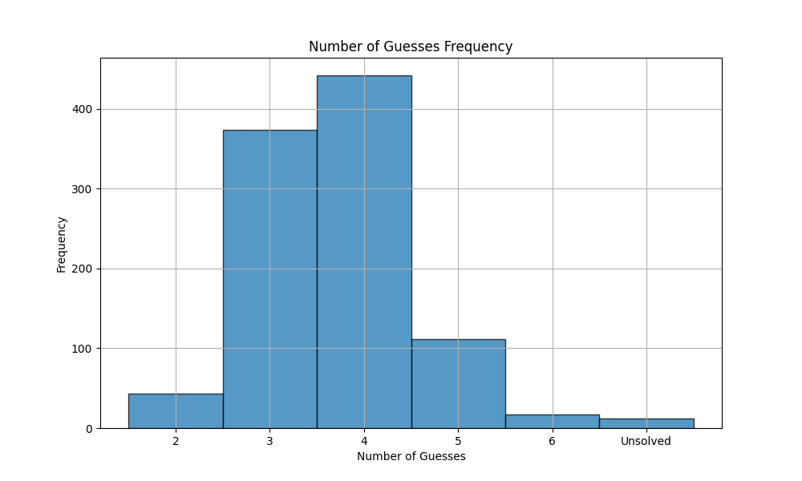
  This bar chart shows the distribution of the number of guesses frequency.
- #### Number of Guesses Histogram
  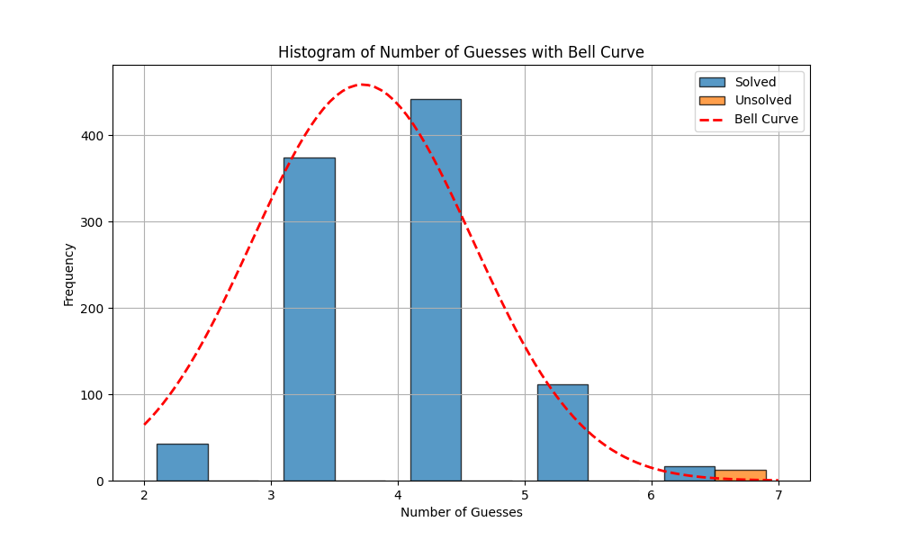
  This histogram shows the distribution of the number of guesses and also plots a bell curve to show the data spread.
- #### Number of Guesses Box Plot
  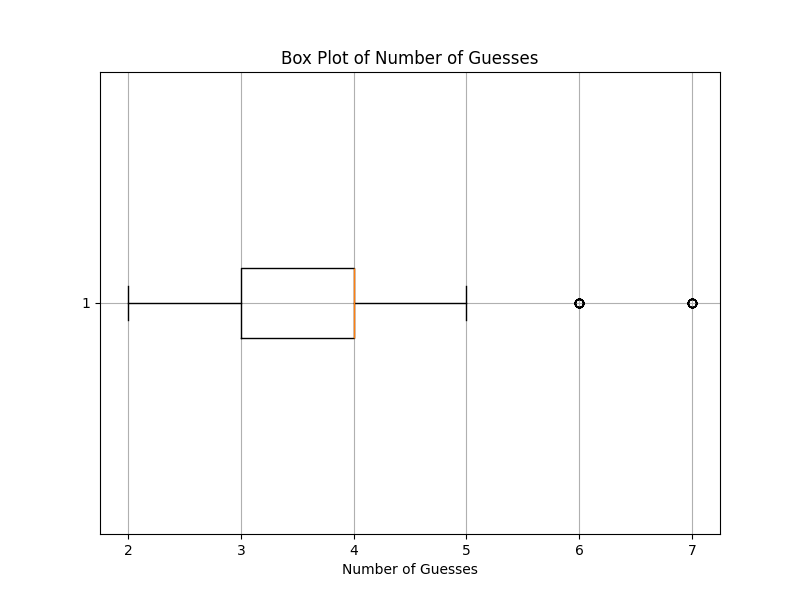
  This box plot shows the quantile values for number of guesses.
- #### Number of Guesses Error Bars
  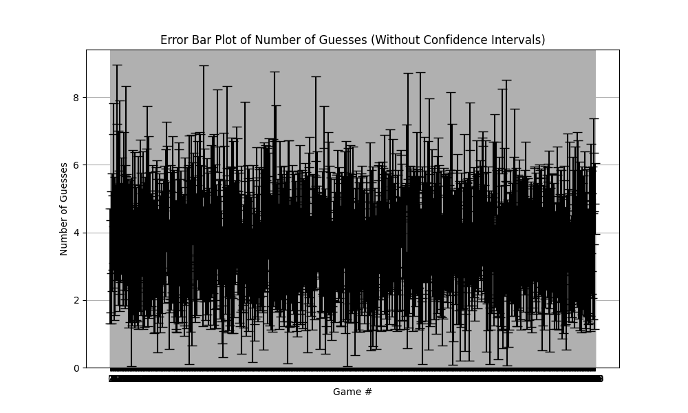
  Displays the error bars of the number of guesses
- #### Number of Guesses Violin Plot
  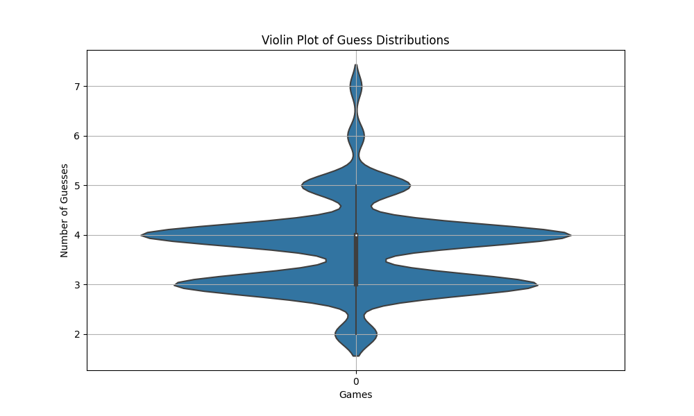
  This violin chart shows the frequency of the number of guesses.
- #### Time Per Game Scatter Plot
  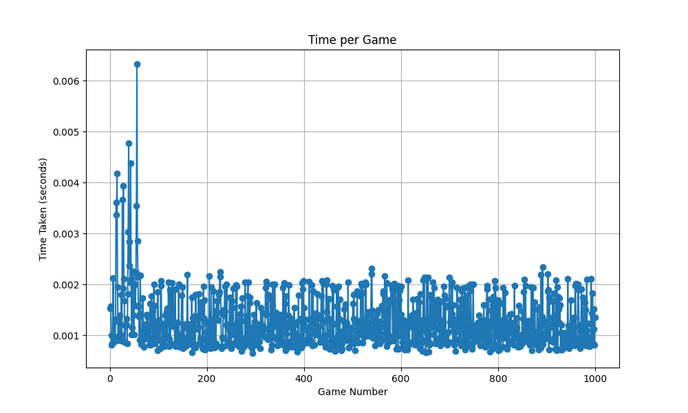
  This scatterplot shows time per game.
- #### Solve Status Box Plot
  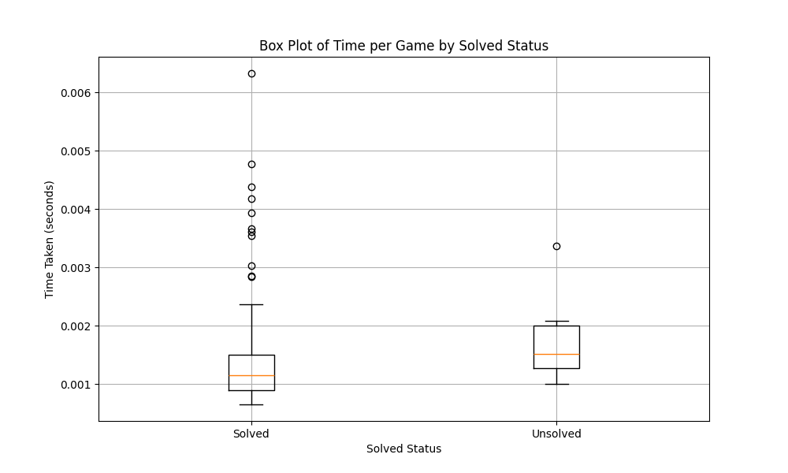
  The line plot shows the time taken for each game, providing a view of the time distribution across multiple games.
- #### Time vs The Number of Guesses Scatter Plot 
  
- #### Letter Frequency in Solution Words Bar Plot
  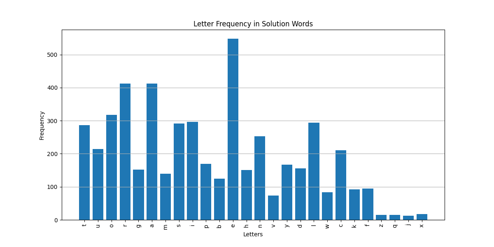
- #### Top 50 First Result Distribution Bar plot
  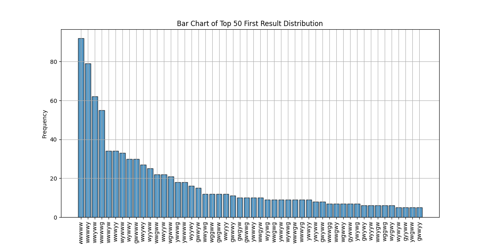
- #### First Result Categories Pie Chart
  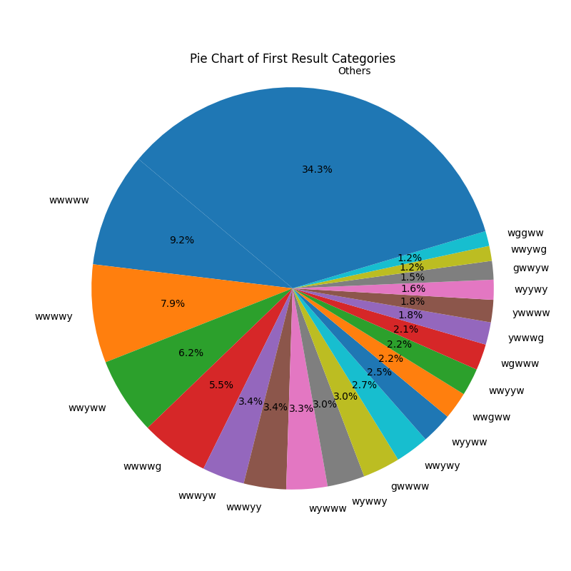
- #### Starting Result -> Number of Guesses Heatmap
  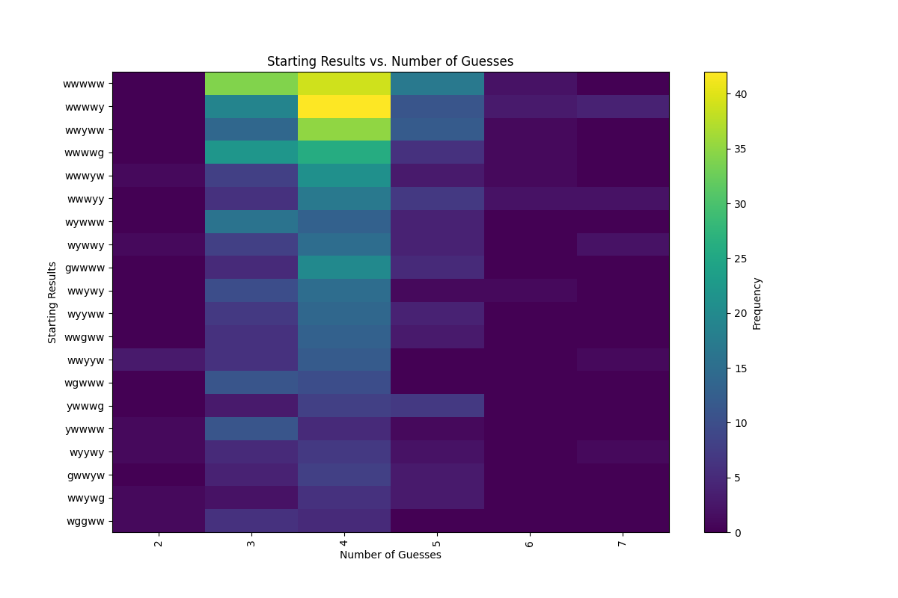
- #### Number of 'w's in starting Result vs Number of Guesses Scatter Plot
  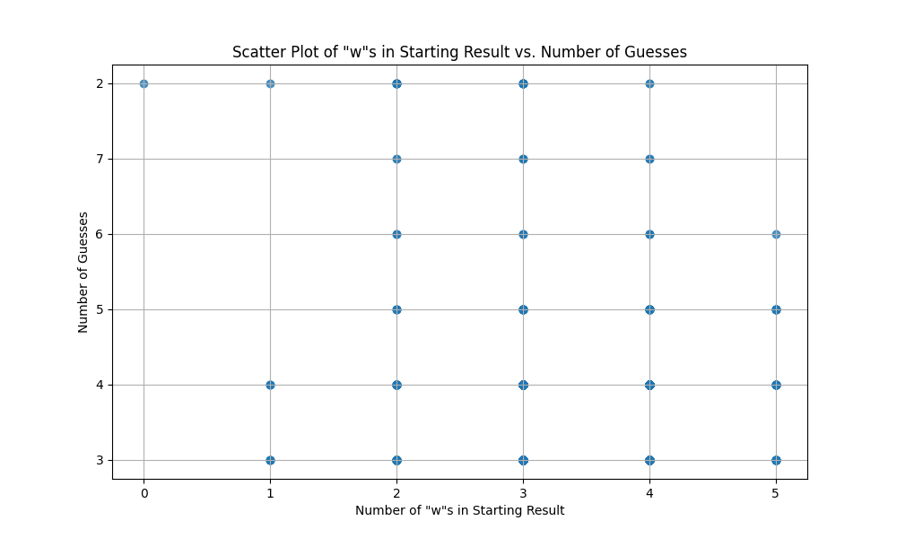
- #### Top 10 Most Frequent Words Bar Chart
  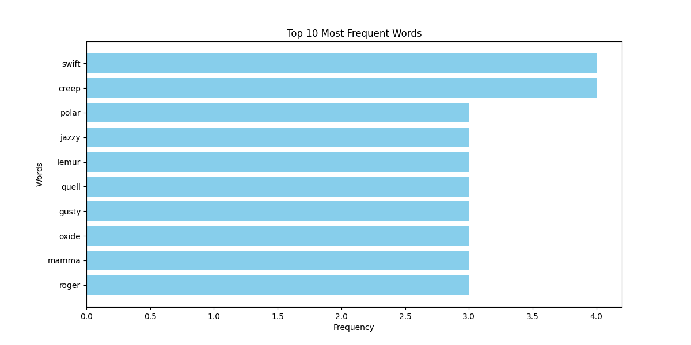
- #### Word Cloud of Solution Word Frequency
  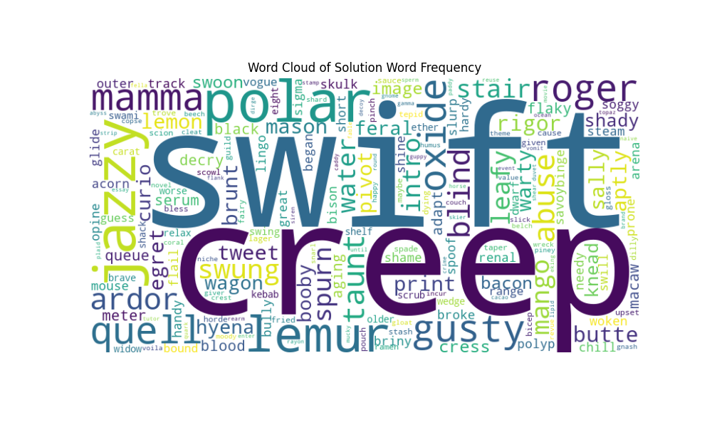
- #### Solution word to Average Guesses Bar Chart
  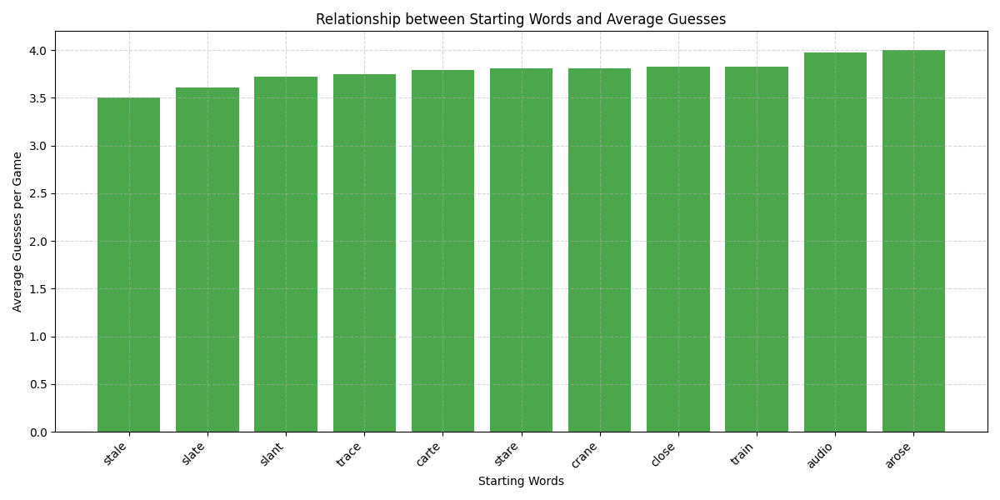

          
## Installation

### Required Packages
  - Python 3
  - selenium 
  - matplotlib
  - wordcloud
  - collections
  - beautifulsoup4
  - numpy 
  - seaborn
  - pandas
  - csv

### Setup
#### 1. Download Repository
      git clone https://github.com/josephjquinn/word-wise.git
      
#### 2. Navigate to scripts directory
      cd scripts
      
#### 3. Start Program
      python {script_name}.py
      
